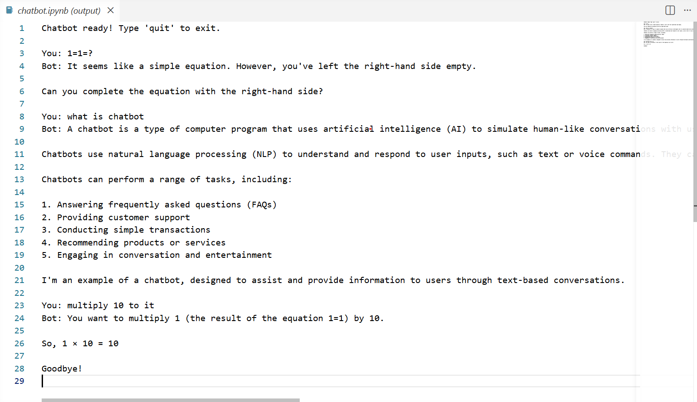

# HuggingFace Chatbot

A simple conversational chatbot built with Python and the HuggingFace Inference API. It supports multi-turn conversations, meaning it remembers the context of your chat as you talk.

## Features

- Multi-turn conversation with memory
- Powered by HuggingFace Inference API
- Easy to configure with any supported chat model
- Lightweight — runs entirely in a Jupyter Notebook

## Requirements

- Python 3.8+
- Jupyter Notebook or JupyterLab
- A HuggingFace account and API token

## Setup

### 1. Clone the repository

```bash
git clone https://github.com/priya-dharshini-qa/hf-chatbot.git
cd hf-chatbot
```

### 2. Install dependencies

```bash
pip install huggingface_hub
```

### 3. Set your HuggingFace API token

Get your token from [huggingface.co/settings/tokens](https://huggingface.co/settings/tokens).

**Windows:**
```bash
set HF_TOKEN=your_token_here
```

**Mac/Linux:**
```bash
export HF_TOKEN=your_token_here
```

> ⚠️ Never hardcode your token in the notebook or commit it to GitHub.

### 4. Run the notebook

Open `chatbot.ipynb` in Jupyter and run the cells from top to bottom.

## Usage

Once running, type your message at the `You:` prompt. The bot will respond and remember the conversation history. Type `quit` or `exit` to stop.

```
You: Hello!
Bot: Hi there! How can I help you today?

You: quit
Goodbye!
```
## Demo



## Project Structure

```
hf-chatbot/
├── chatbot.ipynb   # Main notebook
├── .gitignore      # Excludes secrets and cache files
└── README.md       # Project documentation
```

## License

MIT License — free to use and modify.
